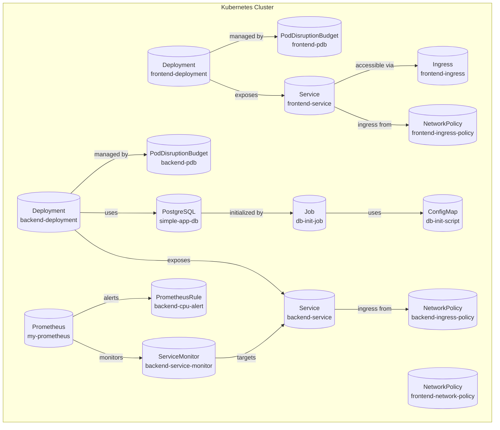

# Simple Kubernetes Application

This is a simple application to demonstrate how to deploy a simple application consisting of a frontend, backend and database to a kubernetes cluster. Also features monitoring and metric collection via Prometheus.

## Description

This simple app features a very basic web interface with multiple instances of a counter and a button. Selecting a counter instance and pressing the button advances the counter by 1. The counter stats are written to the DB and persist throughout all sessions.

## Requirements/Dependencies

### General requirements 
A domain (or a dns redirect) is required to deploy and access this application. The provided placeholder domain is "yaml.check".

### Required operators and CRDs
Install the postgres operator using [HELM](https://helm.sh/docs/intro/install/):

### Add the postgres-operator repo

```sh
helm repo add postgres-operator-charts https://opensource.zalando.com/postgres-operator/charts/postgres-operator
```

### Install the postgres-operator

```sh
helm install postgres-operator postgres-operator-charts/postgres-operator -f postgres-operator-values.yaml -n yaml-yodelers --create-namespace
```

### Install the nginx controller

```sh
kubectl apply -f https://raw.githubusercontent.com/kubernetes/ingress-nginx/controller-v1.10.0/deploy/static/provider/cloud/deploy.yaml
```

## Deploy the application

### Deploy the [Prometheus Operator](https://github.com/prometheus-operator/prometheus-operator?tab=readme-ov-file#quickstart)
 Note: manifest [bundle.yaml](https://raw.githubusercontent.com/prometheus-operator/prometheus-operator/main/bundle.yaml) is modified according to the linked [quickstart](https://github.com/prometheus-operator/prometheus-operator?tab=readme-ov-file#quickstart) guide to change the RBAC namespace from default to yaml-yodelers.

```sh
kubectl create -f prometheus-bundle.yaml -n yaml-yodelers
```

### Apply all the kubernetes resources necessary for the application and also the monitoring using Prometheus

```sh
kubectl apply -f k8s/ -n yaml-yodelers
```

### Create and populate the database

```sh
# wait for the database to be ready
kubectl wait --for=condition=Ready pod -n yaml-yodelers -l cluster-name=simple-app-db

# create the database
export PGMASTER=$(kubectl get pods -n yaml-yodelers -o jsonpath={.items..metadata.name} -l application=spilo,cluster-name=simple-app-db,spilo-role=master -n yaml-yodelers)
kubectl exec -n yaml-yodelers $PGMASTER -- psql -U simple_app_user -d simple_app -c "$(cat setup-db.sql)"
```

### Access the application (on a local deployment)

The frontend service is exposed on port 80. You can access the application using one of the following methods:

1.  Using `kubectl` port-forwarding:

    ```sh
    kubectl port-forward -n yaml-yodelers svc/frontend-service 8080:80
    ```

2.  Using `minikube`

    ```sh
    minikube service -n frontend-service
    ```
### Access the application (using nginx)
<TODO>

### Access the Prometheus Web UI
<TODO> (optional?)

### Note about Prometheus metrics and alarms

Prometheus default metrics are collected for the backend. (via /metrics)
One alarm is configured to monitor for high CPU usage on the backend.

## Diagram (overview) of the architecture



## High Availibity considerations
- Each pod has a minimum of one running instance
- Each pod spawns 2 replicas
- The frontend is dependend on the backend, and the backend is dependend on the DB.
- The backend could in theory also accept "API" calls by eg. curl if the frontend is unavailable (but in this case this is rather unimportant, as it is literally a _counter_ )

## Maintainer & Developer
- Anton Pieper (anton.pieper@informatik.hs-fulda.de)
- Semin Buljevic (semin.buljevic@informatik.hs-fulda.de)

## TODO
1. Verify that Prometheus works, ~perhaps add monitors for remaining services (eg. postgres)~ (more monitors not necessary)
2. Add PDB, routing and security policies etc. to all remaining manifests
3. ~Minimize the amount of "kubectl apply"'s necessary for deployment~ (convert to helm chart?)
4. Fix whatever else that does not work  

## Other notes
1. Using the Prometheus Operator "Quick Start" bundle.yaml is not deploying a full Prometheus stack, but should be enough for basic monitoring
2. ~The bundle.yaml is supposed to be deployed to the default namespace, might need forked version to point all the RBAC services to our namespace (see quick start guide @prometheus operators git)~ 
    - Forked and modified bundle.yaml is now included
3. fixed the nginx deployment issue as described [here](https://stackoverflow.com/questions/61365202/nginx-ingress-service-ingress-nginx-controller-admission-not-found)


## Architecture
